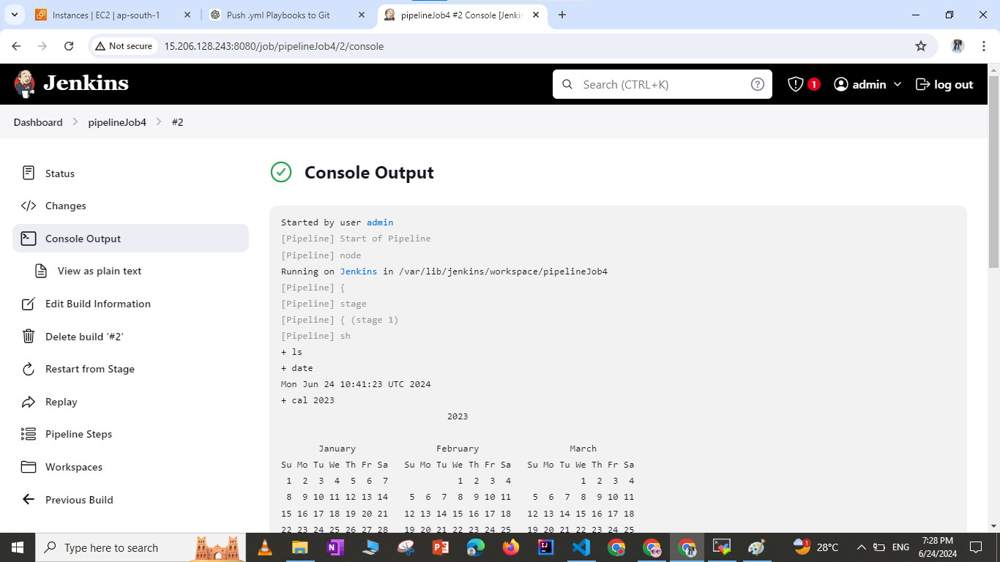

# PIPEINES
In the context of DevOps, pipelines are used to automate the process of building, testing, and deploying applications. They ensure continuous integration and continuous deployment (CI/CD) practices are followed. There are primarily two types of pipeline syntax in DevOps, especially in tools like Jenkins: Declarative and Scripted. Here’s a detailed explanation of these types:

1. Scripted pipeline
2. Declarative pipeline 
3. GitLab CI/CD Pipelines

## Declarative pipeline 
This is a relatively recent addition to Jenkins Pipeline and provides a simpler and more structured way to define CI/CD pipeline. It have more straightforward syntax and enforces a specific structure to make it easier to understand and manage.

## Scripted pipeline
This is a flexible and powerful option that uses Groovy code to define the pipeline. This type of pipeline is comparetively more complex .

### LAB
For this pipelines i have launced 1 EC2 linux instance with 15 gb ram and t2.medium AMI ,connected with instnace using mobaxterm and installed git,java,maven and jenkins on that.
JAVA_HOME and M2_HOME are set as environmental variables in the linux system as below:

```bash
vi ~/.bash_profile

 

Check the following to see that M2_HOME, java are set.

```bash
mvn -version

```bash
echo $M2_HOME

once everything is installed properly , start jenkins service by below command
``` bash
service jenkins start

loging to jebkins server using public ip of instance followed by :8080

Install required plugins like GitHub plugin ,Maven Invoker plugin, Maven Integration plugin, Pipeline: Stage View Plugin , Pipeline 

Graphically stage view can be seen as :
 

Check logs/ output of particular stage by clicking on that stage on graphical view as below:
 

Console output of the same can be seen like below with detailed ino about the stages:
 

Else you can choose option as below to directly clone repository from SCM as below:
